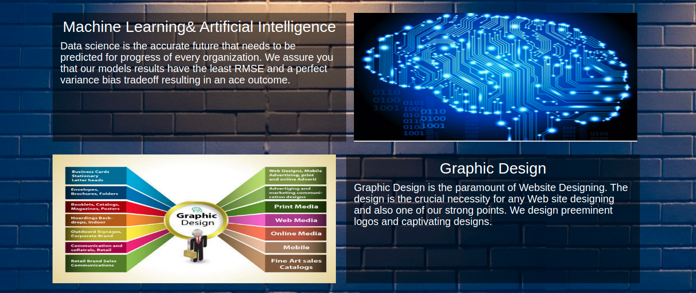

# The CodeSure Software Solutions Pvt Limited 

### About Us :book:
CodeSure is a Software cum Web development company with an expertise in building machine learning models. We are a team of young and ambitious people based out in Sector-3 , Noida , India. We offer the best services to our clients at the least market price. We have a very unique approach to enhance our customers’ revenues. Our machine learning models will ensure that our clients get the best solution to their problem.

### Why Choose CodeSure :question:
We build Software that are scalable & reliable .
Build affordable, Easy- to-use & feature-rich Applications for your business.

### Didn’t find your industry solution :question:
*Discuss your Software requirements with our team & get the finest fit for your business.*

Codesure has developers that are subject matter experts of their respective technologies. They leverage their experience & experts to deliver top-notch software development solutions.

* Outsource projects
* Augment team
* Upscale development capabilities

### Our Missions and Values :dart:
We have only one aim i.e. GRATIFIED CLIENTS ARE THE KEY TO A THRIVING ORGANIZATION. Our services can open all the doors despite of language barriers. We provide a robust solution keeping in mind all the factors that might affect the project in future. Our methodology also focuses on retaining our clients rather than gathering new ones every time. We aim at building both professional and personal relations with our clients.
In this agile world, we focus on amplifying our clients’ returns by providing them the best services at a nominal price. Our goal is to link each and every technology with machine learning algorithms so that we can give the most accurate results.

### Our Services 

  <i>Connect With Us.</i>

  

    
    
    
  

